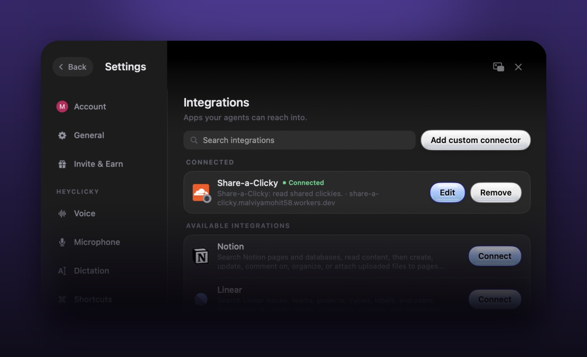

# Share-a-Clicky

Share a Clicky that already does a real job. A friend copies its setup, pastes it into HeyClicky's New Clicky screen, connects their apps, and starts from something a person they trust already runs.

An unofficial prototype for [HeyClicky](https://www.heyclicky.com/), built by Mohit Malviya. Not affiliated with or endorsed by HeyClicky.

**Try it**
- Share page: https://mohit-malviya-ai-pm.github.io/share-a-clicky/
- Connector for HeyClicky: https://share-a-clicky.malviyamohit58.workers.dev/mcp (Settings > Integrations > Add custom connector > Server URL, Authentication: None)

## Why this

| What I saw | Source |
|---|---|
| HeyClicky relaunched as Clickys on Sep 12. New users get three Clickys made from four questions, and New Clicky runs an interview. Both start from HeyClicky's guess about you, not from a Clicky someone already runs | Changelog v1.0.49 |
| The Skills library (about 100 community skills at launch) was paused on Sep 12, with a plan to bring skills back in a new form | Changelog v1.0.33 and v1.0.49 |
| Invite & Earn launched Sep 24: a friend gets 25% off their first month, and the sharer earns 25% of what they pay for up to 12 months | Changelog v1.0.52 |
| Agent messages are the metered part of every plan (Free 25, Pro 150, Max 1,000 a month) | heyclicky.com pricing |

The bet: a Clicky shared by someone you trust, for a job they actually have, is a strong first or second Clicky next to HeyClicky's own suggestions. It also gives Invite & Earn something specific to send ("here's the Clicky I use for X") instead of a bare link. That's a hypothesis, and the metrics below are how I'd test it.

Every shared Clicky shows its estimated monthly agent messages against Free and Pro. Job Hunter runs daily and needs about 30 a month, so the page says plainly that it needs Pro. That's a clearer upgrade moment than hitting a limit mid-month.

## How it works

```
data/clickys.source.json  ──build.py──►  docs/clickys.json             (share page, GitHub Pages)
   (single source of truth)          ├─►  connector/local/clickys.json  (Mac connector)
                                     └─►  connector/worker/worker.js    (remote connector, data inlined)
```

- **Share page** (`docs/`): static, no framework. Gallery plus one page per Clicky (`?c=job-hunter`) with what it does, schedule, apps, message estimate, and a Copy setup button. Each Clicky also gets a share link (`/c/job-hunter/`) whose link preview names that Clicky. Tested at phone and desktop widths, light and dark, including measured text contrast.
- **Connector** with two read-only tools, `list_shared_clickys` and `get_shared_clicky`, in two runtimes. Tests send the same 39 normal and malformed messages, and 11 raw inputs (bad JSON, deep nesting, oversized bodies, batches), to both and require identical answers:
  - `connector/local/share_a_clicky_mcp.py`: MCP over stdio, Python, zero dependencies, for "Command on this Mac".
  - `connector/worker/worker.js`: MCP over Streamable HTTP on Cloudflare Workers, one file, for "Remote URL".
- Setup text, message estimates, plan percentages and the MCP tool definitions are generated once by `build.py` and shared by the page and both connectors. `python3 build.py --check` fails if any generated file is stale. The protocol handling itself is written twice (Python and JavaScript), which is what the parity test is for.
- Job Hunter is the Clicky I built for my own job search. The other two are labeled as examples.

## What I tested live in HeyClicky 1.0.52 (Sep 28, 2026)

<p align="center"></p>

<p align="center"></p>

Screenshots are from the live test on HeyClicky 1.0.52: two turns in one chat through the remote connector, and the remote connector in Settings. My other Clickys are hidden.

| Test | Result |
|---|---|
| Add the local connector as a custom connector | ✅ Connected |
| A Clicky lists shared Clickys and returns a setup | ✅ 10 to 20 seconds, correct setup, told me to paste it into New Clicky |
| Paste the setup into New Clicky | ✅ "Job Hunter" created with the right job and first tasks, in about 20 seconds. It then asks you to connect its apps and create its routine, which are separate steps |
| Ask a Clicky to create a new Clicky by itself | ❌ There's no tool for it. My first version let it try to click through HeyClicky's own UI, and it stalled. The connector now tells it to hand the setup over, and it no longer tries |
| Second turn in the same chat with the local connector | ❌ HeyClicky reports "Transport closed" and never contacts the process again, though the process is alive and idle |
| New Clicky screen uses a connector | ❌ The creation interview doesn't call tools |
| Routine at a set weekday time | ⚠️ Routines repeat on an interval, so shared Clickys use "every 24 hours" style schedules |
| Remote (Cloudflare) connector, two turns in one chat | ✅ Both turns answered (10s and 17s). The remote connector avoids the "Transport closed" bug |

## Known limits, and what would remove them

| Limit | What HeyClicky could add |
|---|---|
| Install is one paste, not one click | A `create_clicky` tool for agents, or a `heyclicky://new?setup=` link. Then the share page button installs directly |
| Local connectors only answer the first turn of a chat | Keep the stdio session alive across turns, or respawn it |
| New Clicky can't read a shared setup | Let the creation flow accept a share link |
| No weekday or time-of-day routines | Weekday and time schedules |
| Message counts are estimates for the routine alone (one agent message per run; other chats and retries add more) | Real usage shown on each shared Clicky |
| A shared setup is instructions for an agent that can reach your email and calendar. Someone could share one that asks for more than it says | The page shows the full text before you copy it. HeyClicky could list the apps and actions a setup touches at install, and review or verify shared Clickys |
| Cloudflare's default bot protection answers 403 to clients that identify as Python's `urllib` | Not an issue for HeyClicky's own client; send a custom User-Agent if you script against it |
| Shared Clickys live in a JSON file, not user uploads | A "Share this Clicky" button that publishes to your heyclicky.com/@username page |

## Metrics I'd watch

Share page views to installs, installs to first routine run, 7-day retention of shared-Clicky installs vs Clickys made in onboarding, invite signups per shared Clicky, and Free-to-Pro upgrades from Clickys marked "Needs Pro".

## Run it

Needs Python 3.8+ and Node 18+. The browser checks (`tests/page_check.py`) also need Playwright (`pip install playwright && playwright install chromium`) and are skipped without it; everything else still runs.

```bash
python3 build.py          # regenerate data for the page and both connectors
./run_tests.sh            # freshness check, Python and Worker connector tests, browser checklist
```

Local connector in HeyClicky: Settings > Integrations > Add custom connector > Advanced > Command on this Mac. Command `python3`, Arguments `/full/path/to/connector/local/share_a_clicky_mcp.py`. Logging is off by default. Set `SHARE_A_CLICKY_LOG=/path/to/file` in the connector's environment variables to debug. The log records the metadata HeyClicky sends with each call.

Deploy the Worker: paste `connector/worker/worker.js` into a new Cloudflare Worker, or run `npx wrangler deploy` in `connector/worker`.

See [SPEC.md](SPEC.md) for the full spec and acceptance checks.

## License

MIT
