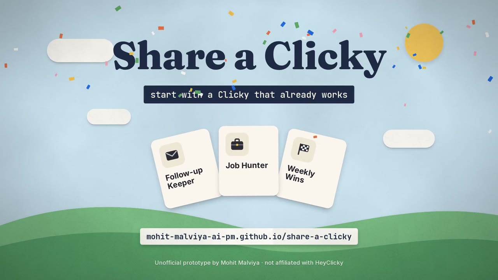
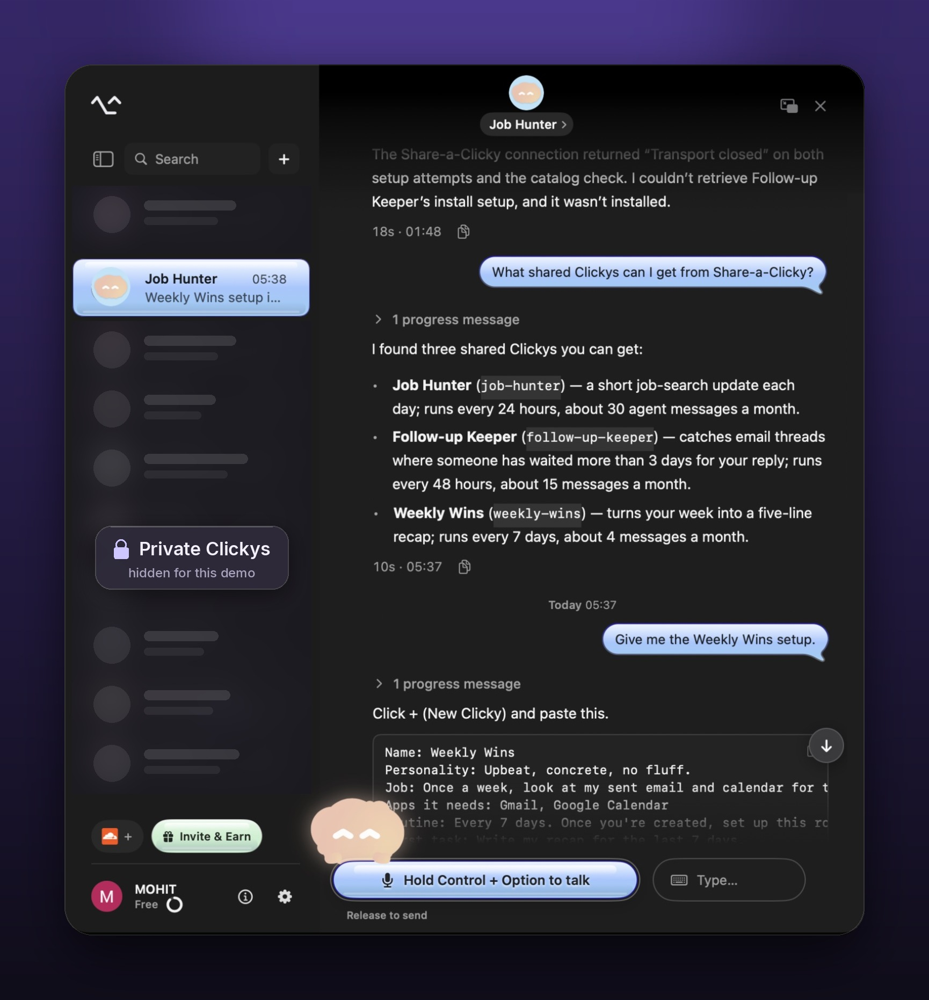

# Share-a-Clicky

**Start with a Clicky that already works.** Share a Clicky you've set up for a real job. A friend pastes its setup into HeyClicky, connects their apps, and starts from something that already works. Your invite link comes along.

An unofficial prototype for [HeyClicky](https://www.heyclicky.com/), built by [Mohit Malviya](https://www.linkedin.com/in/malviyamohit/). Not affiliated with or endorsed by HeyClicky.

<p align="center"><a href="https://mohit-malviya-ai-pm.github.io/share-a-clicky/#demo"></a><br><sub>▶ Watch the 60-second demo</sub></p>

**Try it:** [share page](https://mohit-malviya-ai-pm.github.io/share-a-clicky/) · connector URL `https://share-a-clicky.malviyamohit58.workers.dev/mcp`

## The idea

| | |
|---|---|
| **The gap** | Today a new Clicky comes from HeyClicky's four onboarding questions or a short interview. There's no way to start from a Clicky a friend already runs for a real job. |
| **The idea** | A share page for Clickys. Each one shows what it does, how often it runs, which apps it needs, and roughly how many agent messages it uses. One button copies its setup. |
| **Why HeyClicky might care** | Invite & Earn gives people a reason to share. A shared Clicky gives that invite link something specific to carry: "here's the Clicky I use for my job search," not just "try this app." |

This is a bet, not a proven result. The metrics I'd use to test it are at the bottom.

## How to use it

**From the share page**
1. Open the [share page](https://mohit-malviya-ai-pm.github.io/share-a-clicky/) and pick a Clicky.
2. Click **Copy setup**.
3. In HeyClicky, click **+** (New Clicky) and paste. Connect the apps it asks for, then tell it "create your routine."

**From inside HeyClicky**
1. Open **Settings**, then **Integrations**, then **Add custom connector**.
2. Paste the connector URL above and set Authentication to **None**.
3. In any Clicky, ask: "What shared Clickys can I get?"

(A connector is a plug-in that lets a Clicky use an outside tool. This one can only read the list of shared Clickys.)

## What I found while building it

I tested everything live in HeyClicky 1.0.52 on Sep 28, 2026.

| What happened | What would fix it |
|---|---|
| **Connectors that run on your Mac stop after the first message.** The second message in the same chat fails with "Transport closed." The web-hosted connector here doesn't have this problem. | Keep the Mac connector's session open between messages, or restart it |
| **A Clicky can't create a Clicky.** When I asked one to install a shared Clicky, it tried to click through HeyClicky's own screens and got stuck. So install is one paste, not one click. | A `create_clicky` tool, or a `heyclicky://new` link the share page's button could open |
| **Daily routines need Pro.** Job Hunter runs every day and uses about 30 agent messages a month. Free includes 25. | Nothing to fix. The page says "needs Pro" up front instead of letting people hit a limit mid-month |

Smaller ones: the New Clicky screen can't use connectors, and routines repeat on an interval ("every 24 hours") instead of at a set time.

<p align="center"></p>

## Why I think it matters

| What I saw | Where |
|---|---|
| Clickys relaunched Sep 12. New users answer four questions and get three Clickys made for them | Changelog v1.0.49 |
| The community Skills library (about 100 skills at launch) was paused Sep 12, with a plan to bring skills back in a new form | Changelog v1.0.33 and v1.0.49 |
| Invite & Earn launched Sep 24: a friend gets 25% off their first month, the sharer earns 25% of what they pay for up to 12 months | Changelog v1.0.52 |
| Agent messages are the metered part of every plan: Free 25, Pro 150, Max 1,000 a month | heyclicky.com pricing |

**Metrics I'd watch:** share page views to installs, installs to first routine run, 7-day retention of shared Clickys vs onboarding Clickys, invite signups per shared Clicky, and Free-to-Pro upgrades from Clickys marked "needs Pro."

Job Hunter is the Clicky I built for my own job search. The other two are labeled as examples.

<details>
<summary><b>For engineers: how it's built, tests, and running it</b></summary>

### How it's built

```
data/clickys.source.json  ──build.py──►  docs/clickys.json             (share page, GitHub Pages)
   (single source of truth)          ├─►  connector/local/clickys.json  (Mac connector)
                                     └─►  connector/worker/worker.js    (web connector, data inlined)
```

- **Share page** (`docs/`): static, no framework. A gallery plus one view per Clicky (`?c=job-hunter`). Each Clicky also gets a share link (`/c/job-hunter/`) whose link preview names that Clicky.
- **Connector**: an MCP server with two read-only tools, `list_shared_clickys` and `get_shared_clicky`, written twice:
  - `connector/local/share_a_clicky_mcp.py`: MCP over stdio, Python, no dependencies, for "Command on this Mac."
  - `connector/worker/worker.js`: MCP over Streamable HTTP on Cloudflare Workers, one file, for "Remote URL."
- Setup text, message estimates, plan percentages and tool definitions are generated once by `build.py` and shared by the page and both connectors. `python3 build.py --check` fails if a generated file is stale.

### Tests

- The same 39 normal and malformed messages, plus 11 raw inputs (bad JSON, deep nesting, oversized bodies, batches), go to both connectors, which must answer identically.
- Browser checks at phone and desktop widths, light and dark, including measured text contrast.

### Full test log from HeyClicky 1.0.52

| Test | Result |
|---|---|
| Add the Mac connector as a custom connector | ✅ Connected |
| A Clicky lists shared Clickys and returns a setup | ✅ 10 to 20 seconds, correct setup, told me to paste it into New Clicky |
| Paste the setup into New Clicky | ✅ "Job Hunter" created with the right job and first tasks in about 20 seconds. Connecting apps and creating the routine are separate steps after that |
| Ask a Clicky to create a new Clicky by itself | ❌ No tool for it. It tried to drive HeyClicky's UI and stalled. The connector now tells it to hand the setup over instead |
| Second message in the same chat, Mac connector | ❌ "Transport closed," and HeyClicky never contacts the process again, though it's alive and idle |
| New Clicky screen uses a connector | ❌ The creation interview doesn't call tools |
| Routine at a set weekday time | ⚠️ Routines repeat on an interval, so shared Clickys use "every 24 hours" style schedules |
| Web connector, two messages in one chat | ✅ Both answered (10s and 17s) |

### Known limits

| Limit | What HeyClicky could add |
|---|---|
| Install is one paste, not one click | A `create_clicky` tool, or a `heyclicky://new?setup=` link |
| Message counts are estimates for the routine alone (one agent message per run; other chats and retries add more) | Real usage shown on each shared Clicky |
| A shared setup is instructions for an agent that can reach your email and calendar. Someone could share one that asks for more than it says | The page shows the full text before you copy it. HeyClicky could list the apps and actions a setup touches at install, and review shared Clickys |
| Shared Clickys live in a JSON file, not user uploads | A "Share this Clicky" button that publishes to your heyclicky.com/@username page |
| Cloudflare's default bot protection answers 403 to clients that identify as Python's `urllib` | Send a custom User-Agent if you script against it |

### Run it

Needs Python 3.8+ and Node 18+. The browser checks also need Playwright (`pip install playwright && playwright install chromium`) and are skipped without it.

```bash
python3 build.py          # regenerate data for the page and both connectors
./run_tests.sh            # freshness check, connector tests, browser checks
```

Mac connector in HeyClicky: Settings, Integrations, Add custom connector, Advanced, Command on this Mac. Command `python3`, arguments `/full/path/to/connector/local/share_a_clicky_mcp.py`. Logging is off by default; set `SHARE_A_CLICKY_LOG=/path/to/file` in the connector's environment to debug.

Deploy the Worker: paste `connector/worker/worker.js` into a new Cloudflare Worker, or run `npx wrangler deploy` in `connector/worker`.

Full spec and acceptance checks: [SPEC.md](SPEC.md).

</details>

## License

MIT
